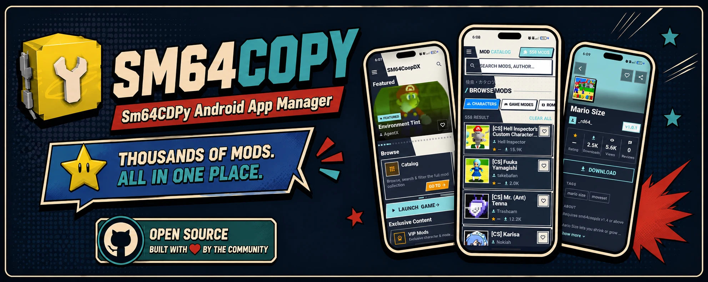

# SM64CDPY — SM64CoopDX Mods Browser

**English** · [Español](README_ES.md) · [Português do Brasil](README_PT.md)

SM64CDPY is an unofficial, Android-focused mod browser and manager for
**SM64CoopDX**. It brings mod discovery, downloads, installation, game
integration, and catalogue updates into a single mobile interface instead of
requiring users to move repeatedly between a browser, file manager, and the
game.

The project is currently returning to active maintenance. Its declared version
is **1.7.0+18**. The floating overlay introduced for the 1.7 line is implemented
but remains experimental until it completes broader testing on real Android
devices and across process recreation scenarios.




-orange)


## What the application is for

SM64CDPY is intended to become a practical mobile companion for SM64CoopDX.
Its main potential is not limited to displaying a list of mods: it can connect
the complete flow from discovering content to placing it in a game-accessible
folder while keeping the user informed of download and extraction progress.

The application can serve as:

- A searchable, categorized catalogue of community content.
- A local favourites library that can be exported and restored.
- A download manager with background progress, cancellation, and notifications.
- An installer for ZIP, 7z, and standalone files through Android's Storage
  Access Framework.
- A launcher and companion overlay that can remain accessible while the game is
  open.
- A delivery channel for refreshed catalogues and ABI-specific app updates.

This foundation leaves room for safer automated installation, richer catalogue
metadata, better recovery after Android terminates the app, and a more seamless
in-game mod workflow.

## Current features

- Browse, search, filter, sort, and paginate the main mod catalogue.
- View popular and featured content.
- Browse dedicated VIP, DynOS, Touch Controls, OMM Rebirth, and Render96
  sections.
- Save favourites locally and import or export them as JSON.
- Use English, Spanish, or Brazilian Portuguese with light and dark themes.
- Refresh bundled catalogues from their remote JSON sources.
- Select persistent destination folders with Android's system folder picker.
- Resolve download links, including GitHub Release assets.
- Download and install mods in the background using WorkManager.
- Display foreground notifications, progress, errors, and cancellation actions.
- Install ZIP and 7z archives or copy standalone files.
- Launch SM64CoopDX from the app when it is installed.
- Check GitHub Releases for an APK matching the device ABI and perform OTA
  updates.

## Floating overlay

The floating bubble runs in a second Flutter engine over the game. It provides
catalogue search, download requests, cancellation, and live progress forwarded
from the main application engine.

The implementation already includes the bridge between both engines and the
WorkManager installation pipeline. It is still considered experimental because
the engines do not share memory and Android may recreate either process. Testing
is still needed for concurrent downloads, permission changes, process death,
and Android versions from 7 through 16.

See [Downloads, installation, and overlay](docs/DOWNLOADS_AND_OVERLAY.md) for
the technical flow.

## Project status

- **Catalogue:** implemented with bundled databases and manual remote refresh.
- **Downloads and installation:** implemented with WorkManager, foreground
  services, notifications, and SAF.
- **Floating overlay:** implemented, but undergoing stabilization and device
  testing.
- **App updates:** implemented through GitHub Releases and per-ABI APKs.
- **Supported platform:** Android 7.0 or newer (`minSdk 24`). The generated
  Linux scaffold is not a supported product target.
- **Automated tests:** no `test/` or `integration_test/` suite currently exists.
  Static analysis and CI builds are the existing automated checks.

Read [Project status and next steps](docs/PROJECT_STATUS.md) before starting new
implementation work.

## Quick start

Requirements: Flutter **3.41.7**, Dart **3.11.x**, Java 17, and the Android SDK.
A release build also requires `android/key.properties` and its matching
keystore.

```bash
flutter pub get
flutter analyze --no-fatal-infos
flutter build apk --release --target-platform android-arm64 --split-per-abi
```

The arm64 APK is written to
`build/app/outputs/flutter-apk/app-arm64-v8a-release.apk`.

See [BUILDING.md](BUILDING.md) for the complete environment, signing, and build
guide.

## Documentation

The canonical documentation index is [docs/README.md](docs/README.md):

- [Current architecture](docs/ARCHITECTURE.md)
- [Downloads, installation, and overlay](docs/DOWNLOADS_AND_OVERLAY.md)
- [Project status, risks, and next steps](docs/PROJECT_STATUS.md)
- [SM64CDPY v1.7.0 task checklist](docs/SM64CDPY-v1.7.0-TASK-CHECKLIST.md)
- [GitHub Actions and releases](docs/CI_CD.md)
- [Local build guide](BUILDING.md)
- [Archived documentation and local references](docs/archive/README.md)

## Local reference repositories

The workspace may contain cloned projects such as **Komi Store**,
**Floating Apps examples**, and other experiments used only for research. They
are excluded by `.gitignore`, are not application modules, and must not be
uploaded to this repository or included in project analysis/builds. The
documentation archive records their purpose without publishing their contents.

## Releases

The release workflow produces separate APKs for `arm64-v8a`, `armeabi-v7a`, and
`x86_64`. Published builds are available from
[GitHub Releases](https://github.com/retired64/sm64cdpy.releases/releases).

## Privacy and project scope

The app has no accounts, advertising, or telemetry. It uses the network to load
catalogues, resolve and download files, check for updates, and open external
resources. Favourites and preferences are stored locally on the device.

SM64CDPY is an independent, unofficial personal project. It is not affiliated
with, endorsed by, or approved by SM64CoopDX, Nintendo, or any mod author. Mods,
names, images, and related content belong to their respective creators.

## Contact

[Discord](https://discord.com/invite/thuhUH2WNX) ·
[GitHub profile](https://github.com/retired64)
