# SM64CoopDX Mods Browser

[English](README.md) · [Español](README_ES.md) · **Português**

> Um app pessoal para Android que permite explorar, pesquisar e gerenciar mods de **SM64 Coop Deluxe** — não oficial, feito com ❤️ para a comunidade.

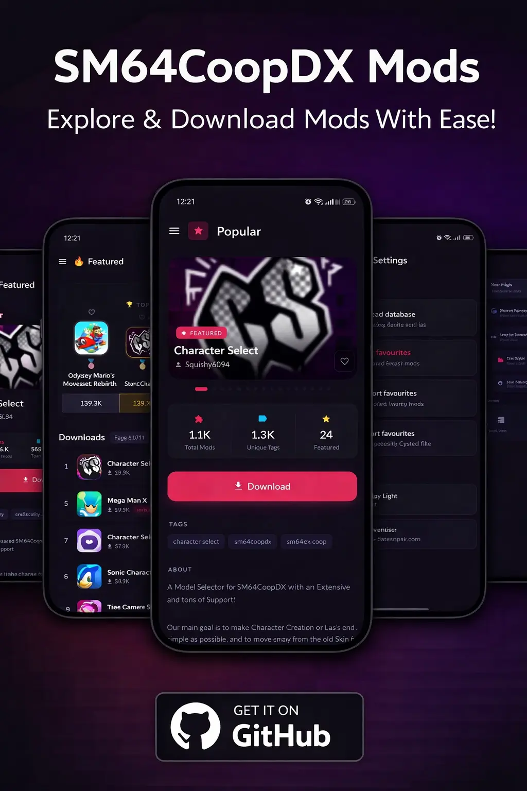

<div align="center">

| Início | Início (Claro) | Popular | Popular (Claro) | Menu |
|:---:|:---:|:---:|:---:|:---:|
| 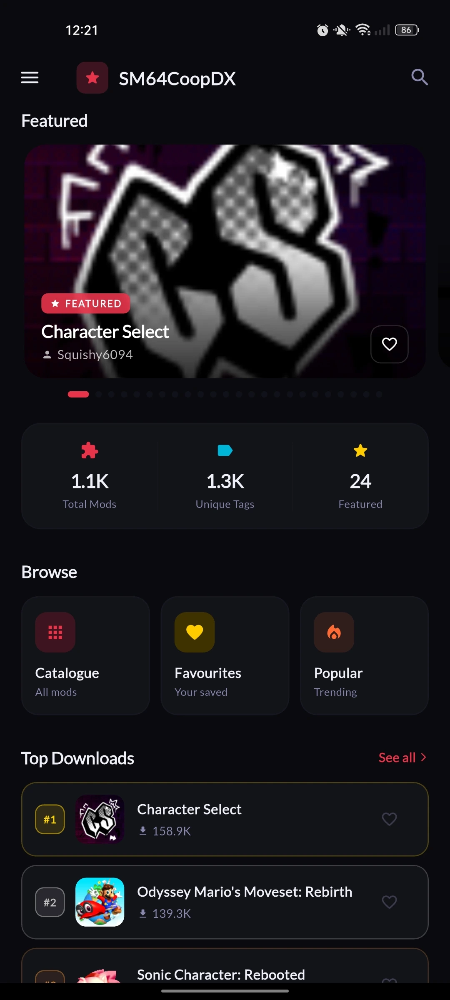 | 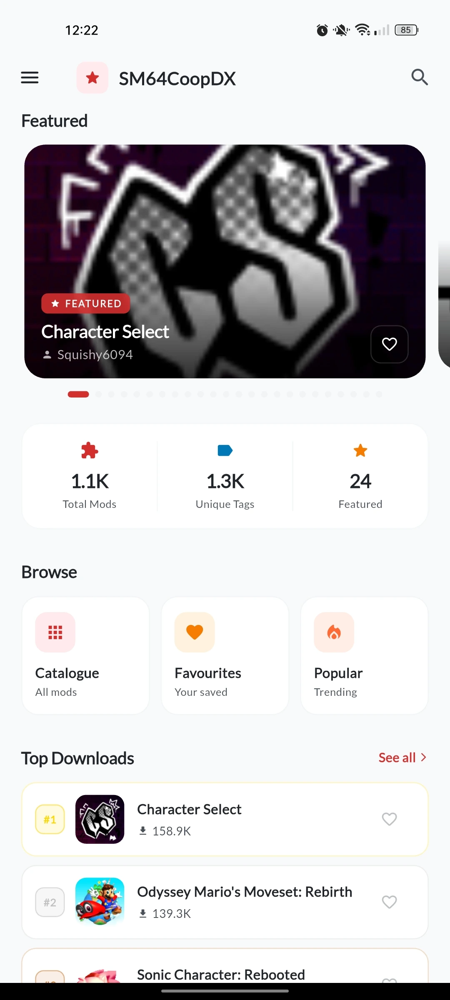 | 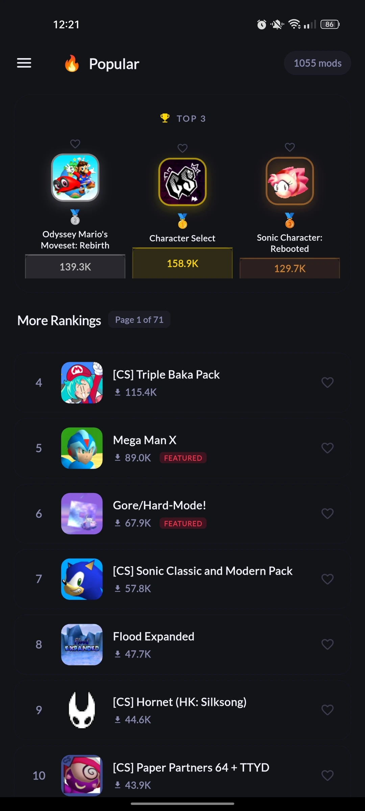 | 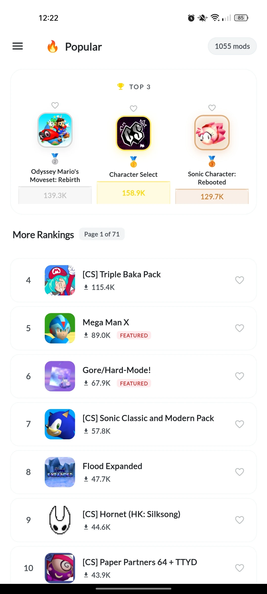 | 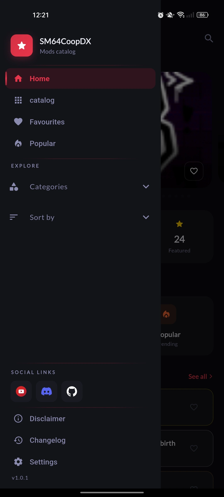 |

| Detalhes do Mod | Detalhes do Mod (Claro) | Detalhes do Mod (Claro 2) | Configurações | Configurações (Claro) |
|:---:|:---:|:---:|:---:|:---:|
| 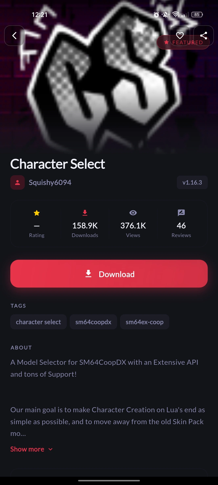 | 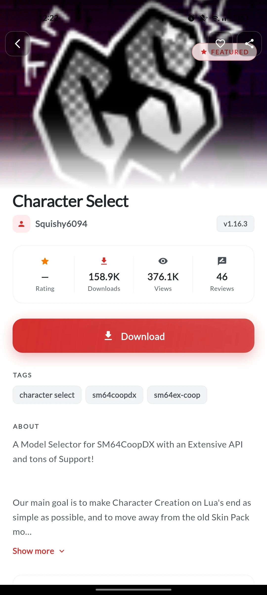 | 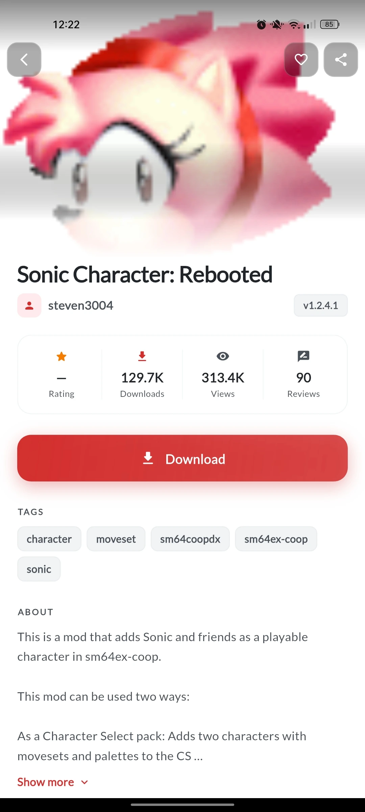 | 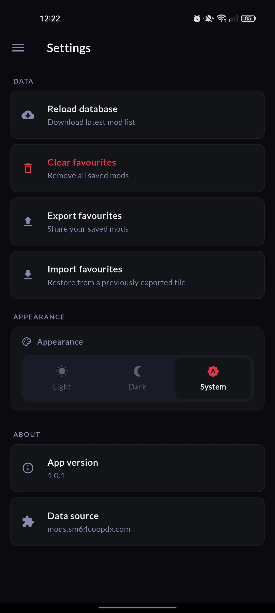 | 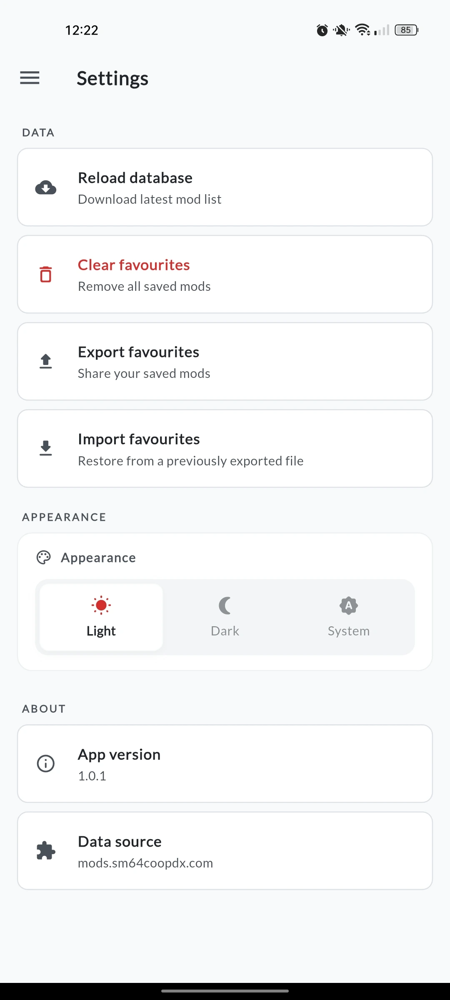 |

</div>


---

## Início rápido

```bash
# 1. Clonar o repositório
git clone --depth 1 https://github.com/retired64/sm64cdpy.releases.git
cd sm64cdpy.releases

# 2. Instalar as dependências
flutter pub get

# 3. Compilar (arm64 — recomendado para a maioria dos dispositivos)
flutter build apk --release --target-platform android-arm64

# Saída: build/app/outputs/flutter-apk/app-release.apk
```

## 📥 Download

Vá até a seção de [**Releases**](https://github.com/retired64/sm64cdpy.releases/releases) e baixe o arquivo `.apk` mais recente.

> **Apenas Android.** Mínimo Android 7.0 (Marshmallow).

---

## O que é isto?

É um app pessoal que eu fiz para poder explorar e organizar os mods de SM64 Coop Deluxe direto do meu celular, sem precisar abrir o navegador toda vez. Ele lê o catálogo público de mods do sm64coopdx e o apresenta em uma interface móvel limpa e rápida.

Não é oficial. Não tem nenhuma relação com a equipe do SM64CoopDX nem com os criadores de mods. É apenas um projeto pessoal.

## O que você pode fazer com ele?

- **Explorar o catálogo completo** — todos os mods do site oficial, em um só lugar.
- **Pesquisar instantaneamente** — encontre qualquer mod por nome, autor ou tag enquanto digita.
- **Filtrar por categoria** — Personagens, Modos de Jogo, ROM Hacks, Visuais, Áudio, Utilitários e mais.
- **Ordenar mods** — por avaliação, downloads ou os atualizados mais recentemente.
- **Ver o que é popular** — uma tela dedicada com os mods mais baixados, do maior para o menor.
- **Salvar favoritos** — toque no coração de qualquer mod para salvá-lo. Sua lista permanece salva mesmo se você fechar o app.
- **Exportar e importar favoritos** — salve sua lista de favoritos como um arquivo `.json` e restaure-a quando quiser, mesmo após reinstalar ou trocar de dispositivo.
- **Tela de detalhes do mod** — descrição completa, capturas de tela, tags, estatísticas, histórico de atualizações e links de download direto.
- **Atualizar o banco de dados** — toque em *Reload database* nas Configurações para baixar a lista de mods mais recente diretamente deste repositório do GitHub. Sem precisar reinstalar o app.
- **Tema claro e escuro** — escolha a aparência que preferir ou deixe seguir a configuração do seu sistema.
- **Bilíngue** — a interface do app inclui uma tela de Aviso Legal bilíngue (inglês / espanhol).

## Como instalar

1. Baixe o `.apk` na página de [Releases](https://github.com/retired64/sm64cdpy.releases/releases).
2. No seu celular Android, abra o arquivo. Se ele pedir permissão para instalar de fontes desconhecidas, permita — isso é normal para apps que não vêm da Play Store.
3. Instale e abra. É só isso.

## Como atualizar a lista de mods

O app vem com uma cópia local do banco de dados. Quando novos mods são adicionados ao site oficial, você pode atualizar sua lista sem reinstalar:

1. Abra o app → toque no **ícone de menu** (canto superior esquerdo) → **Settings**.
2. Toque em **Reload database**.
3. O app baixa a lista mais recente deste repositório e atualiza tudo automaticamente.

## É seguro?

Sim. O app não coleta nenhum dado, não exige conta, não exibe anúncios e não se comunica com nenhum servidor além deste repositório do GitHub (e apenas quando você toca em Reload manualmente). Seus favoritos são armazenados localmente no seu dispositivo.

---

## ⚠️ Aviso Legal

Este app é um **projeto pessoal não oficial**. Não é associado, endossado ou aprovado pelos desenvolvedores de SM64CoopDX, Super Mario 64, Nintendo, nem por qualquer criador de mods. Todos os nomes, imagens e conteúdos de mods exibidos pertencem aos seus respectivos autores.

---

## 📬 Contato

Encontrou um bug ou tem uma sugestão? Fale comigo no Discord.

[](https://discord.com/invite/thuhUH2WNX)

---

<div align="center">
  <sub>Feito com ❤️ para uso pessoal · Sem afiliação oficial · <a href="https://github.com/retired64/sm64cdpy.releases/releases">Baixar o APK mais recente</a></sub>
</div>
