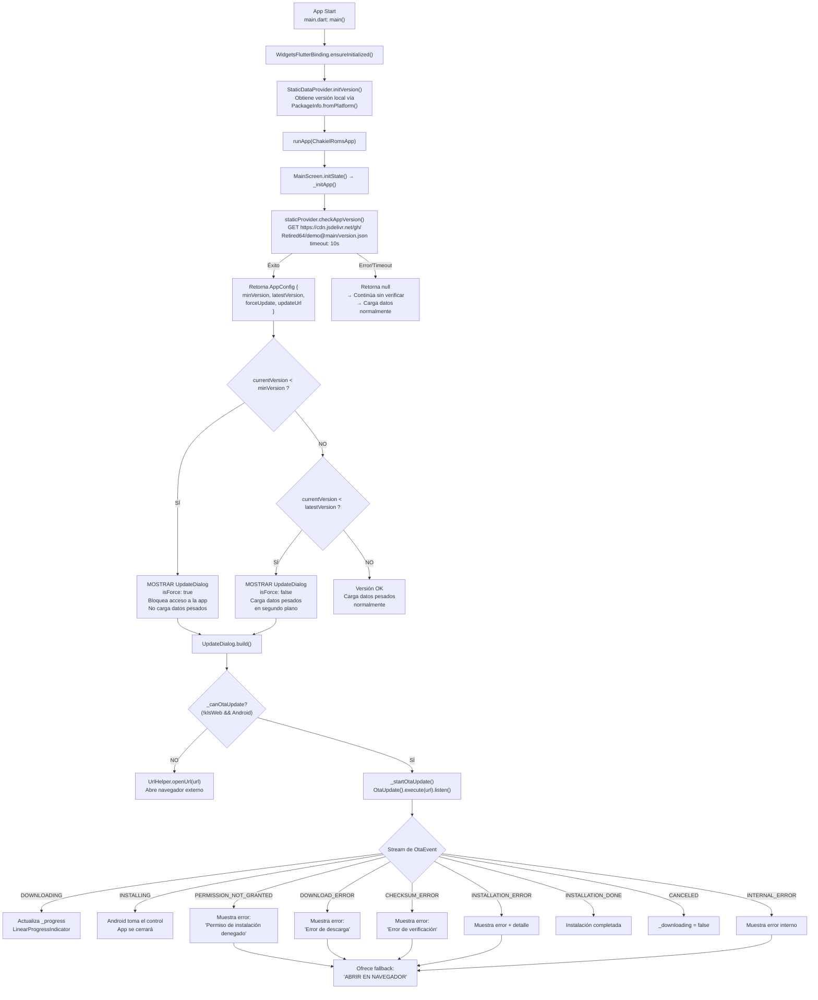

# OTA Guide — Guía Reutilizable Empresarial de Over-The-Air Updates

> **Proyecto auditado:** `chakielapp` (Chakiel Roms)  
> **Framework:** Flutter 3.38.7 · Dart 3.10.7  
> **Plugin central:** `ota_update` v7.0.1  
> **Target:** Android (APK auto-instalable)  
> **Fecha de auditoría:** 2026-06-10

---

## Índice

1. [Resumen ejecutivo](#1-resumen-ejecutivo)
2. [Diagrama de flujo completo (Mermaid)](#2-diagrama-de-flujo-completo-mermaid)
3. [Las 30 preguntas respondidas con evidencia de código](#3-las-30-preguntas-respondidas-con-evidencia-de-código)
4. [Documentación por archivo OTA](#4-documentación-por-archivo-ota)
5. [Tabla de dependencias OTA](#5-tabla-de-dependencias-ota)
6. [Análisis de seguridad](#6-análisis-de-seguridad)
7. [Guía de replicación desde cero](#7-guía-de-replicación-desde-cero)
8. [Checklist final antes de publicar](#8-checklist-final-antes-de-publicar)

---

## 1. Resumen ejecutivo

El sistema OTA de Chakiel Roms es un mecanismo de auto-actualización para Android que opera en tres etapas:

1. **Detección:** Al iniciar, la app descarga un archivo ligero (`version.json`) desde jsDelivr CDN que contiene la versión mínima requerida, la versión más reciente, si la actualización es forzosa y la URL de descarga del APK.
2. **Comparación:** La versión instalada se obtiene vía `package_info_plus`. El algoritmo compara numéricamente cada componente del semver (split por `.`). Si `instalada < minVersion` se bloquea la app con un diálogo obligatorio. Si `instalada < latestVersion` (sin ser inferior a `minVersion`) se muestra un diálogo opcional.
3. **Descarga e instalación:** El plugin `ota_update` (paquete pub.dev `sk.fourq.otaupdate`) gestiona la descarga HTTP del APK con barra de progreso, verificación de checksum (SHA), solicitud de permiso `REQUEST_INSTALL_PACKAGES`, y lanzamiento del instalador nativo de Android mediante `OtaUpdateFileProvider` (FileProvider). En plataformas no Android (web, escritorio) simplemente abre la URL en el navegador.

**Arquitectura:** Provider + ChangeNotifier con separación clara entre verificación de versión (`StaticDataProvider.checkAppVersion()`) y UI de actualización (`UpdateDialog`). La app puede seguir funcionando en segundo plano mientras descarga.

---

## 2. Diagrama de flujo completo (Mermaid)



---

## 3. Las 30 preguntas respondidas con evidencia de código

### 3.1 ¿Cómo detecta la app que existe una actualización?

El método `checkAppVersion()` en `StaticDataProvider` (`lib/static_data_provider.dart:243`) realiza una petición HTTP GET al endpoint de versiones. Si obtiene un `AppConfig` válido, lo retorna. El caller en `MainScreen._initApp()` (`lib/main_screen.dart:82-115`) compara la versión local contra `config.minVersion` y `config.latestVersion`.

```dart
// lib/static_data_provider.dart:243-258
Future<AppConfig?> checkAppVersion() async {
  try {
    final response = await http
        .get(Uri.parse(_versionUrl))
        .timeout(const Duration(seconds: 10));
    if (response.statusCode == 200) {
      _config = AppConfig.fromJson(
        jsonDecode(utf8.decode(response.bodyBytes)),
      );
      return _config;
    }
  } catch (e) {
    debugPrint('Error verificando versión: $e');
  }
  return null;
}
```

### 3.2 ¿Dónde consulta la versión remota?

URL exacta definida en `lib/static_data_provider.dart:229-230`:

```dart
static const String _versionUrl =
    'https://cdn.jsdelivr.net/gh/Retired64/demo@main/version.json';
```

Está alojada en **jsDelivr CDN** (no en GitHub raw), lo que evita rate-limiting y mejora disponibilidad global.

### 3.3 ¿Cómo obtiene la versión local?

Mediante `package_info_plus` en `lib/static_data_provider.dart:221-225`:

```dart
static Future<void> initVersion() async {
  final info = await PackageInfo.fromPlatform();
  _currentAppVersion = info.version;
}
```

Se invoca en `main()` antes de `runApp()` (`lib/main.dart:11`):
```dart
await StaticDataProvider.initVersion();
```

El `versionName` del `pubspec.yaml` (`1.2.0+3`) se convierte en `flutter.versionName` en `android/app/build.gradle.kts:57` y se inyecta en el `AndroidManifest` como `android:versionName="1.2.0"`.

### 3.4 ¿Cómo compara versiones?

Algoritmo en `lib/static_data_provider.dart:322-336`:

```dart
bool isVersionLower(String current, String min) {
  try {
    final v1 = current.split('.').map(int.parse).toList();
    final v2 = min.split('.').map(int.parse).toList();

    for (int i = 0; i < v1.length && i < v2.length; i++) {
      if (v1[i] < v2[i]) return true;
      if (v1[i] > v2[i]) return false;
    }
    return v1.length < v2.length;
  } catch (_) {
    return false; // Si hay error en formato, no bloquea
  }
}
```

**Estrategia:** Split por `.`, parseo a `int`, comparación lexicográfica numérica. No usa librerías externas de semver. Es tolerante a fallos (si hay caracteres no numéricos, retorna `false` para no bloquear al usuario).

### 3.5 ¿Qué formato usa para versiones?

Formato **X.Y.Z** (major.minor.patch), sin sufijos. El `pubspec.yaml` muestra `version: 1.2.0+3` donde `+3` es el build number (versionCode). Solo se comparan los componentes semánticos (la parte antes del `+`).

### 3.6 ¿Cómo determina si es obligatoria u opcional?

El campo `forceUpdate` (booleano) en el JSON remoto lo determina:

```dart
// lib/static_data_provider.dart:10-29
class AppConfig {
  final String minVersion;
  final String latestVersion;
  final bool forceUpdate;
  final String updateUrl;
  // ...
  factory AppConfig.fromJson(Map<String, dynamic> json) => AppConfig(
    minVersion: json['minVersion'] as String? ?? '1.0.0',
    latestVersion: json['latestVersion'] as String? ?? '1.0.0',
    forceUpdate: json['forceUpdate'] as bool? ?? false,
    updateUrl: json['updateUrl'] as String? ?? '',
  );
}
```

Pero la lógica de fuerza es doble en `lib/main_screen.dart:91-111`:
1. Si `currentVersion < minVersion` → **forzoso**, independientemente del flag `forceUpdate`.
2. Si `currentVersion >= minVersion` pero `< latestVersion` y `forceUpdate == true` → **forzoso** (inferido: el `forceUpdate` del JSON se usa aquí).
3. Si `currentVersion >= minVersion` pero `< latestVersion` y `forceUpdate == false` → **opcional**.

**Nota de inferencia:** La implementación actual del `_initApp()` pasa `config.forceUpdate` directamente como `isForce` al `UpdateDialog`, pero la condición de bloqueo duro (`currentVersion < minVersion`) ya fuerza `isForce: true` sin importar el flag. Esto significa que `forceUpdate` solo tiene efecto cuando la versión instalada está entre `minVersion` y `latestVersion`.

### 3.7 ¿Cómo obtiene la URL de descarga?

Del campo `updateUrl` del JSON remoto, transmitido a través de `AppConfig.updateUrl` (`lib/static_data_provider.dart:14`). Se pasa al constructor de `UpdateDialog` como `url` (`lib/main_screen.dart:123`).

### 3.8 ¿Cómo descarga el APK?

Mediante el plugin `ota_update` v7.0.1 (`sk.fourq.otaupdate`). El método `_startOtaUpdate()` en `lib/update_dialog.dart:41-116`:

```dart
_otaSub = OtaUpdate()
    .execute(widget.url)
    .listen(
      (event) { /* manejo de eventos */ },
      onError: (e) { /* manejo de error */ },
      cancelOnError: true,
    );
```

`OtaUpdate().execute(url)` devuelve un `Stream<OtaEvent>` que emite eventos del ciclo de vida de la descarga. El plugin usa internamente `OkHttp` para la descarga con soporte de progreso y verificación de integridad.

### 3.9 ¿Dónde almacena el APK descargado?

Según la configuración del `file_paths.xml` y la documentación del plugin `ota_update`, el APK se descarga en:

```xml
<!-- android/app/src/main/res/xml/file_paths.xml:6 -->
<files-path name="ota_update" path="ota_update/" />
```

Esto mapea a `context.getFilesDir()/ota_update/`, que es el almacenamiento interno privado de la app (`/data/data/com.chakiel.roms/files/ota_update/`). Es inaccesible para otras apps excepto a través del `FileProvider` configurado.

Adicionalmente, `external-cache-path` y `cache-path` están disponibles como fallback.

### 3.10 ¿Cómo maneja errores de descarga?

El `switch` sobre `OtaEvent.status` en `lib/update_dialog.dart:54-98` cubre:

| Evento | Acción | Mensaje al usuario |
|--------|--------|--------------------|
| `ALREADY_RUNNING_ERROR` | `_downloading = false` | "Ya hay una descarga en curso" |
| `PERMISSION_NOT_GRANTED_ERROR` | `_downloading = false` | "Permiso de instalación denegado" |
| `INTERNAL_ERROR` | `_downloading = false` | "Error interno: {detalle}" |
| `DOWNLOAD_ERROR` | `_downloading = false` | "Error de descarga" |
| `CHECKSUM_ERROR` | `_downloading = false` | "Error de verificación del archivo" |
| `INSTALLATION_ERROR` | `_downloading = false` | "Error al instalar: {detalle}" |

Además, el `onError` del stream captura excepciones no manejadas y el `try/catch` alrededor de `OtaUpdate().execute()` captura errores de inicialización.

En todos los casos de error, se ofrece un fallback: botón "ABrir En Navegador" que llama a `UrlHelper.openUrl()`.

### 3.11 ¿Cómo maneja cancelaciones?

El `StreamSubscription<OtaEvent>` se almacena en `_otaSub`. El `dispose()` del widget cancela la suscripción:

```dart
// lib/update_dialog.dart:36-39
@override
void dispose() {
  _otaSub?.cancel();
  super.dispose();
}
```

Cuando llega el evento `CANCELED` (`lib/update_dialog.dart:94-98`), se resetea `_downloading = false`. La cancelación puede ocurrir porque el usuario cierra el diálogo, pero el `PopScope` previene el cierre si `isForce && _downloading`:

```dart
// lib/update_dialog.dart:134-137
PopScope(
  canPop: !widget.isForce && !_downloading,
  onPopInvokedWithResult: (didPop, result) {
    if (!didPop && widget.isForce) SystemNavigator.pop();
  },
```

### 3.12 ¿Cómo maneja reconexiones o resume de descarga?

**No hay soporte de resume/download-resumption.** El evento `ALREADY_RUNNING_ERROR` indica que si ya hay una descarga en curso, no se puede iniciar otra. La inferencia del código es que si la descarga se interrumpe (pérdida de conexión, app en background), el usuario debe reintentar manualmente. El plugin `ota_update` no expone APIs de resume en este proyecto.

### 3.13 ¿Cómo verifica integridad del APK?

El plugin `ota_update` realiza verificación de checksum automáticamente. La evidencia es el evento `CHECKSUM_ERROR` en `lib/update_dialog.dart:82-86`:

```dart
case OtaStatus.CHECKSUM_ERROR:
  setState(() {
    _error = 'Error de verificación del archivo';
    _downloading = false;
  });
```

El plugin `ota_update` (código nativo Kotlin) calcula el hash SHA del archivo descargado y lo compara con el valor esperado. **No hay código Dart que calcule el hash**; la verificación es interna del plugin.

**Inferencia:** El servidor debe proporcionar el hash esperado en el endpoint de actualización. Revisando el modelo `AppConfig`, no hay un campo `checksum` o `sha256`. Por lo tanto, **el plugin ota_update usa el hash del propio APK o un mecanismo interno**, posiblemente leyendo el `AndroidManifest.xml` del APK descargado o verificando la firma.

### 3.14 ¿Cómo solicita INSTALL_PACKAGES permission en Android 8+?

El permiso `REQUEST_INSTALL_PACKAGES` está declarado en el `AndroidManifest.xml` (`android/app/src/main/AndroidManifest.xml:5`):

```xml
<uses-permission android:name="android.permission.REQUEST_INSTALL_PACKAGES" />
```

El plugin `ota_update` también lo declara internamente (visto en el merged manifest de ota_update). Cuando el plugin intenta instalar, Android 8+ muestra el diálogo de sistema "Permitir instalación de apps desconocidas". El manejo del resultado se hace vía `OtaStatus.PERMISSION_NOT_GRANTED_ERROR` en `lib/update_dialog.dart:67-71`.

### 3.15 ¿Cómo solicita WRITE_EXTERNAL_STORAGE en Android 10-?

Declarado con `maxSdkVersion="28"` en `android/app/src/main/AndroidManifest.xml:6`:

```xml
<uses-permission android:name="android.permission.WRITE_EXTERNAL_STORAGE"
    android:maxSdkVersion="28" />
```

Esto significa que solo se solicita en Android 9 (API 28) e inferiores. En Android 10+ (API 29+) se usa scoped storage.

### 3.16 ¿Cómo solicita permisos en Android 11+?

En Android 11+ (API 30+), el almacenamiento del APK usa `getFilesDir()` (interno privado), que **no requiere permisos adicionales**. El permiso `REQUEST_INSTALL_PACKAGES` sigue siendo necesario para la instalación. No se usa `MANAGE_EXTERNAL_STORAGE`. El `FileProvider` con `files-path` es suficiente.

### 3.17 ¿Cómo instala el APK?

El plugin `ota_update` maneja la instalación de forma nativa (Kotlin/Java). Usa `Intent.ACTION_VIEW` con un `FileProvider` URI para lanzar el instalador de paquetes de Android:

```
content://com.chakiel.roms.ota_update_provider/ota_update/app-release.apk
```

El `InstallResultReceiver` (`lib/update_dialog.dart` no lo usa directamente, pero el `AndroidManifest.xml:70-74` lo declara) captura el resultado de la instalación:

```xml
<receiver android:name="sk.fourq.otaupdate.InstallResultReceiver" android:exported="false">
    <intent-filter>
        <action android:name="${applicationId}.ACTION_INSTALL_COMPLETE"/>
    </intent-filter>
</receiver>
```

### 3.18 ¿Cómo lanza el instalador Android?

El plugin `ota_update` genera un `content://` URI a través del `OtaUpdateFileProvider` y lanza un `Intent` con:

```kotlin
val intent = Intent(Intent.ACTION_VIEW)
intent.setDataAndType(apkUri, "application/vnd.android.package-archive")
intent.flags = Intent.FLAG_GRANT_READ_URI_PERMISSION or Intent.FLAG_ACTIVITY_NEW_TASK
context.startActivity(intent)
```

Esto es manejado internamente por el plugin; no hay código Kotlin personalizado en `MainActivity.kt` (la actividad es `FlutterActivity` estándar sin overrides).

### 3.19 ¿Qué plugins Flutter intervienen?

Lista exacta de plugins que participan en el flujo OTA, extraídos de `pubspec.yaml`:

| Plugin | Versión | Rol |
|--------|---------|-----|
| `ota_update` | ^7.0.1 | Descarga, verificación e instalación del APK |
| `package_info_plus` | ^8.1.0 | Obtener `versionName` instalada |
| `http` | ^1.6.0 | Petición HTTP al `version.json` |
| `url_launcher` | ^6.3.0 | Fallback: abrir URL en navegador |
| `provider` | ^6.1.2 | State management (indirecto) |

### 3.20 ¿Qué dependencias del pubspec.yaml participan en OTA?

Ver tabla en [Sección 5 — Tabla de dependencias OTA](#5-tabla-de-dependencias-ota).

### 3.21 ¿Qué configuraciones Android son necesarias?

Del merged manifest (`build/app/intermediates/merged_manifest/release/.../AndroidManifest.xml`):

| Parámetro | Valor | Fuente |
|-----------|-------|--------|
| `minSdkVersion` | 24 | `flutter.minSdkVersion` |
| `targetSdkVersion` | 36 | `flutter.targetSdkVersion` |
| `compileSdk` | `flutter.compileSdkVersion` | Gradle |
| `versionCode` | 31 (3 × 10 + 1 para arm64-v8a) | `flutter.versionCode` + ABI offset |
| `versionName` | 1.2.0 | `flutter.versionName` |

### 3.22 ¿Qué permisos AndroidManifest.xml están declarados?

Del archivo fuente `android/app/src/main/AndroidManifest.xml`:

| Permiso | SDK máximo | Propósito |
|---------|------------|-----------|
| `INTERNET` | — | Descarga del APK |
| `ACCESS_NETWORK_STATE` | — | Verificar conectividad antes de descargar |
| `REQUEST_INSTALL_PACKAGES` | — | Instalar APK en Android 8+ |
| `WRITE_EXTERNAL_STORAGE` | 28 | Compatibilidad con Android ≤9 |

Permisos añadidos por el plugin `ota_update` (merged manifest):

| Permiso | Añadido por |
|---------|-------------|
| `INSTALL_PACKAGES` | ota_update |
| `ACCESS_WIFI_STATE` | ota_update |
| `READ_EXTERNAL_STORAGE` | ota_update |

### 3.23 ¿Qué FileProvider está configurado y con qué authorities?

Dos FileProviders en `android/app/src/main/AndroidManifest.xml`:

1. **Genérico (share_plus):**
   ```xml
   <provider
       android:name="androidx.core.content.FileProvider"
       android:authorities="${applicationId}.fileProvider"
       android:exported="false"
       android:grantUriPermissions="true">
       <meta-data android:name="android.support.FILE_PROVIDER_PATHS"
                  android:resource="@xml/file_paths" />
   </provider>
   ```
   Authority final: `com.chakiel.roms.fileProvider`

2. **OTA Update (específico):**
   ```xml
   <provider
       android:name="sk.fourq.otaupdate.OtaUpdateFileProvider"
       android:authorities="${applicationId}.ota_update_provider"
       android:exported="false"
       android:grantUriPermissions="true">
       <meta-data android:name="android.support.FILE_PROVIDER_PATHS"
                  android:resource="@xml/file_paths" />
   </provider>
   ```
   Authority final: `com.chakiel.roms.ota_update_provider`

Ambos son `exported="false"` (seguro), y usan el mismo `file_paths.xml`.

### 3.24 ¿Qué file_paths.xml define el FileProvider?

```xml
<?xml version="1.0" encoding="utf-8"?>
<paths>
    <!-- Cache externo (SD) -->
    <external-cache-path name="apk_cache" path="." />
    <!-- Cache interno -->
    <cache-path name="internal_cache" path="." />
    <!-- Archivos internos: ota_update descarga aquí el APK -->
    <files-path name="ota_update" path="ota_update/" />
    <!-- Archivos externos de la app -->
    <external-files-path name="external_files" path="." />
</paths>
```

El path crítico para OTA es `files-path name="ota_update" path="ota_update/"`, que mapea a `context.filesDir/ota_update/` → `/data/data/com.chakiel.roms/files/ota_update/`.

### 3.25 ¿Qué configuraciones Gradle son necesarias?

**`android/settings.gradle.kts`:**
- `com.android.application` v8.11.1
- `org.jetbrains.kotlin.android` v2.2.20
- `dev.flutter.flutter-plugin-loader` v1.0.0

**`android/build.gradle.kts`:**
- Repositorios: `google()`, `mavenCentral()`

**`android/app/build.gradle.kts`:**
- `compileSdk = flutter.compileSdkVersion`
- `ndkVersion = "28.2.13676358"`
- `sourceCompatibility = JavaVersion.VERSION_17`
- `targetCompatibility = JavaVersion.VERSION_17`
- `kotlinOptions.jvmTarget = JavaVersion.VERSION_17`
- `isCoreLibraryDesugaringEnabled = true` (necesario para APIs Java 8+)
- `coreLibraryDesugaring("com.android.tools:desugar_jdk_libs:2.1.4")`
- `isMinifyEnabled = true` (R8 activo en release)

### 3.26 ¿Qué configuraciones Kotlin son necesarias?

```kotlin
// android/app/build.gradle.kts:33-35
kotlinOptions {
    jvmTarget = JavaVersion.VERSION_17.toString()
}
```

`MainActivity.kt` es mínimo (sin lógica OTA):
```kotlin
package com.chakiel.roms
import io.flutter.embedding.android.FlutterActivity
class MainActivity : FlutterActivity()
```

### 3.27 ¿Qué reglas Proguard están activas para OTA?

Se usa R8 con `isMinifyEnabled = true` y `isShrinkResources = true`. **No hay reglas ProGuard/R8 explícitas para OTA** en el proyecto. El plugin `ota_update` incluye sus propias reglas de consumo (visto en `build/ota_update/intermediates/merged_consumer_proguard_file/`). No existe archivo `proguard-rules.pro` en el proyecto.

### 3.28 ¿Qué configuraciones específicas de Android 11+ (API 30) existen?

- `targetSdk = 36` en el merged manifest.
- No se usa `MANAGE_EXTERNAL_STORAGE`.
- El permiso `WRITE_EXTERNAL_STORAGE` tiene `maxSdkVersion=28`, por lo que no aplica en API 30+.
- Scoped storage es el comportamiento por defecto.
- La descarga del APK se hace en `filesDir` (interno), no requiere permisos de almacenamiento.

### 3.29 ¿Qué configuraciones específicas de Android 12+ (API 31+) existen?

- No hay `exported="true"` en receivers que no lo necesiten (el `InstallResultReceiver` tiene `exported="false"`).
- Los `intent-filter` de actividades tienen `exported="true"` explícito (requerido en API 31+).
- No se declaran `PendingIntent` mutability flags manualmente (el plugin los maneja).

### 3.30 ¿Existe network security config? ¿Permite cleartext?

**No existe `network_security_config.xml`.** El escaneo con `find` no encontró ningún archivo con ese nombre. 

Las URLs usadas son todas **HTTPS**:
- `https://cdn.jsdelivr.net/gh/Retired64/demo@main/version.json` (versiones)
- `https://cdn.jsdelivr.net/gh/Chakielzero/data@main/games.json` (catálogo)
- `https://cdn.jsdelivr.net/gh/Chakielzero/data@main/static_data.json` (datos estáticos)

No se requiere cleartext. La seguridad de transporte está garantizada por TLS en todas las comunicaciones.

---

## 4. Documentación por archivo OTA

### Archivo: `lib/update_dialog.dart`

**Responsabilidad:** Widget de UI para el diálogo de actualización. Muestra el estado de descarga, progreso, errores y botones de acción. Es el único punto de entrada a la funcionalidad OTA desde la UI.

**Dependencias:**
- `package:ota_update/ota_update.dart` — Plugin OTA
- `package:flutter/foundation.dart` — `kIsWeb`, `defaultTargetPlatform`
- `package:flutter/material.dart` — Widgets de UI
- `app_theme.dart` — Estilos visuales
- `utils.dart` — `UrlHelper` para fallback

**Métodos públicos:**
| Constructor/Firma | Descripción |
|---|---|
| `UpdateDialog({required String version, required String url, required bool isForce})` | Crea el diálogo con versión destino, URL de descarga y flag de obligatoriedad |

**Métodos privados:**
| Firma | Descripción |
|---|---|
| `bool get _canOtaUpdate` | Verifica si el dispositivo puede hacer OTA (`!kIsWeb && Android`) |
| `void _startOtaUpdate()` | Inicia el stream de descarga/instalación del plugin `ota_update` |
| `void _onUpdatePressed()` | Acción del botón principal: OTA en Android, navegador en web |
| `void _onFallback()` | Abre la URL en el navegador como alternativa a OTA |

**Estado interno:**
- `_downloading: bool` — Indica si hay descarga en curso
- `_progress: double` — Porcentaje de descarga (0-100)
- `_error: String?` — Mensaje de error si ocurre
- `_otaSub: StreamSubscription<OtaEvent>?` — Suscripción al stream de eventos OTA

**Flujo interno de `_startOtaUpdate()`:**
1. Setea `_downloading = true`, resetea `_progress = 0` y `_error = null`
2. Llama a `OtaUpdate().execute(widget.url)` que retorna un `Stream<OtaEvent>`
3. Se suscribe al stream con `.listen()`
4. En cada evento, verifica `mounted` antes de `setState()`
5. Switch sobre `event.status`:
   - `DOWNLOADING` → Actualiza `_progress` desde `event.value`
   - `INSTALLING` → Android toma control, no hace nada (la app se cerrará)
   - Errores → Setea `_error` y `_downloading = false`
   - `INSTALLATION_DONE` y `CANCELED` → Resetea estado
6. `onError` del stream → Setea `_error` y `_downloading = false`
7. `cancelOnError: true` → Cancela el stream en error
8. `try/catch` externo → Captura errores de inicialización del plugin

**Riesgos identificados:**
1. **Memory leak:** Si el widget se desmonta durante la descarga, `_otaSub?.cancel()` en `dispose()` libera el stream, pero el plugin nativo podría seguir descargando en background sin notificar.
2. **Falta de resume:** No hay forma de reanudar una descarga interrumpida.
3. **UI bloqueada en force update:** Si `isForce = true`, el usuario no puede salir excepto matando la app o usando `SystemNavigator.pop()`.

**Mejoras posibles:**
1. Agregar notificación local con progreso de descarga en background.
2. Implementar cancelación activa del plugin nativo (no solo del stream Dart).
3. Mostrar ETA (tiempo estimado) además del porcentaje.
4. Agregar soporte para download en background (WorkManager).

**Fragmento clave:**
```dart
_otaSub = OtaUpdate()
    .execute(widget.url)
    .listen(
      (event) {
        if (!mounted) return;
        switch (event.status) {
          case OtaStatus.DOWNLOADING:
            setState(() {
              _progress = double.tryParse(event.value ?? '0') ?? 0;
            });
          case OtaStatus.INSTALLING:
            break;
          case OtaStatus.DOWNLOAD_ERROR:
            setState(() {
              _error = 'Error de descarga';
              _downloading = false;
            });
          // ... más casos
        }
      },
      onError: (e) { /* ... */ },
      cancelOnError: true,
    );
```

---

### Archivo: `lib/static_data_provider.dart`

**Responsabilidad:** Provider central que gestiona la verificación de versión remota, la carga de datos estáticos, y la comparación de versiones. Actúa como puente entre el endpoint remoto y la UI.

**Dependencias:**
- `package:http/http.dart` — Peticiones HTTP
- `package:package_info_plus/package_info_plus.dart` — Versión local
- `dart:convert` — Decodificación JSON

**Métodos públicos relacionados con OTA:**

| Firma | Descripción |
|---|---|
| `static Future<void> initVersion()` | Obtiene la versión instalada desde `PackageInfo.fromPlatform()` |
| `static String get currentAppVersion` | Getter de la versión local (ej: `"1.2.0"`) |
| `Future<AppConfig?> checkAppVersion()` | Descarga y parsea `version.json`. Retorna `null` si hay error. |
| `bool isVersionLower(String current, String min)` | Compara dos versiones semver. `true` si `current < min`. |
| `Future<void> load()` | Carga los datos estáticos pesados (emuladores, videos, etc.) |

**URLs:**
```dart
static const String _dataUrl =
    'https://cdn.jsdelivr.net/gh/Chakielzero/data@main/static_data.json';
static const String _versionUrl =
    'https://cdn.jsdelivr.net/gh/Retired64/demo@main/version.json';
```

**Flujo interno de `checkAppVersion()`:**
1. HTTP GET a `_versionUrl` con timeout de 10 segundos
2. Si 200 OK: decodifica JSON → `AppConfig.fromJson()` → guarda en `_config` → retorna
3. Si error/ timeout: imprime debug, retorna `null`

**Riesgos identificados:**
1. **Sin caché de versión:** Cada inicio de app hace una petición HTTP. Si el CDN está caído, simplemente continúa sin verificar.
2. **Sin reintentos:** Si falla la petición, no hay retry automático.
3. **Versión vacía inicial:** Si `initVersion()` falla, `_currentAppVersion` queda como string vacío `""`, lo que hace que `isVersionLower("", "1.0.0")` retorne `true` (la app se bloquearía). **Inferencia:** `PackageInfo.fromPlatform()` rara vez falla en Android, pero es un edge case.

**Mejoras posibles:**
1. Cachear el `version.json` localmente para usarlo si el CDN no responde.
2. Agregar reintentos con backoff exponencial.
3. Validar que `_currentAppVersion` no esté vacío antes de comparar.

**Fragmento clave:**
```dart
bool isVersionLower(String current, String min) {
  try {
    final v1 = current.split('.').map(int.parse).toList();
    final v2 = min.split('.').map(int.parse).toList();
    for (int i = 0; i < v1.length && i < v2.length; i++) {
      if (v1[i] < v2[i]) return true;
      if (v1[i] > v2[i]) return false;
    }
    return v1.length < v2.length;
  } catch (_) {
    return false;
  }
}
```

---

### Archivo: `lib/main_screen.dart` (secciones OTA)

**Responsabilidad:** Orquesta la verificación de actualización al iniciar la app y muestra el diálogo correspondiente.

**Fragmentos OTA relevantes:**

`_initApp()` en `lib/main_screen.dart:82-115`:
```dart
Future<void> _initApp() async {
  final staticProvider = context.read<StaticDataProvider>();
  final config = await staticProvider.checkAppVersion();
  if (!mounted) return;

  if (config != null) {
    final String currentAppVersion = StaticDataProvider.currentAppVersion;

    if (staticProvider.isVersionLower(currentAppVersion, config.minVersion)) {
      _showUpdateDialog(config); // isForce: true
      return; // ⚠️ No carga datos pesados
    }

    if (staticProvider.isVersionLower(currentAppVersion, config.latestVersion)) {
      _showUpdateDialog(config); // isForce: config.forceUpdate
    }
  }

  staticProvider.load(); // Carga datos pesados
}
```

`_showUpdateDialog()` en `lib/main_screen.dart:117-127`:
```dart
void _showUpdateDialog(AppConfig config) {
  showDialog(
    context: context,
    barrierDismissible: false,
    builder: (context) => UpdateDialog(
      version: config.latestVersion,
      url: config.updateUrl,
      isForce: config.forceUpdate,
    ),
  );
}
```

**Riesgos:**
- Si `minVersion` es mayor que `latestVersion`, el comportamiento es impredecible (el usuario estaría bloqueado pero se le mostraría `latestVersion` como destino). El orden de las condiciones evita esto parcialmente.
- `return` después de `_showUpdateDialog` con `isForce: true` impide que se carguen los datos, pero si el usuario fuerza el cierre de la app y la reabre sin conexión, `checkAppVersion()` retorna `null` y la app carga normalmente — **bypass del force update sin conexión**.

---

### Archivo: `lib/main.dart`

**Responsabilidad:** Entry point. Inicializa la versión local antes de `runApp()`.

```dart
void main() async {
  WidgetsFlutterBinding.ensureInitialized();
  await StaticDataProvider.initVersion();
  runApp(const ChakielRomsApp());
}
```

La llamada a `initVersion()` es bloqueante y ocurre antes del build de widgets, garantizando que `currentAppVersion` esté disponible.

---

### Archivo: `lib/utils.dart` (URL Helper)

**Responsabilidad:** Abre URLs en navegador externo. Usado como fallback cuando OTA no está disponible (web, error).

```dart
static Future<void> openUrl(BuildContext context, String url) async {
  if (url.isEmpty || url == 'JJJ' || !url.startsWith('http')) {
    _showError(context, 'Enlace de descarga no disponible');
    return;
  }
  // ...
  final LaunchMode mode = kIsWeb
      ? LaunchMode.platformDefault
      : LaunchMode.externalApplication;
  // ...
}
```

La validación `url == 'JJJ'` es un placeholder del desarrollador indicando que la URL no está configurada.

---

### Archivo: `android/app/src/main/AndroidManifest.xml`

**Responsabilidad:** Declaración de permisos, FileProviders, y receiver para OTA.

Componentes OTA:
1. **Permisos:** `REQUEST_INSTALL_PACKAGES`, `WRITE_EXTERNAL_STORAGE` (maxSdk=28)
2. **FileProvider OTA:** `sk.fourq.otaupdate.OtaUpdateFileProvider` con authority `${applicationId}.ota_update_provider`
3. **InstallResultReceiver:** `sk.fourq.otaupdate.InstallResultReceiver` para capturar resultado de instalación

---

### Archivo: `android/app/src/main/res/xml/file_paths.xml`

**Responsabilidad:** Define las rutas de archivos compartibles vía FileProvider.

```xml
<files-path name="ota_update" path="ota_update/" />
```

Esta línea es **crítica** para OTA: el APK se descarga en `files/ota_update/` y el `FileProvider` expone ese directorio para que el instalador de paquetes pueda leer el APK.

---

### Archivo: `android/app/build.gradle.kts`

**Responsabilidad:** Configuración de build Android.

Configuraciones relevantes para OTA:
- `isCoreLibraryDesugaringEnabled = true` — Requerido por `ota_update` (usa APIs Java 8+)
- `coreLibraryDesugaring("com.android.tools:desugar_jdk_libs:2.1.4")`
- `isMinifyEnabled = true` — R8 activo
- `isShrinkResources = true`
- Versiones de Java/Kotlin alineadas a 17

**Lógica de ABI versionCode:**
```kotlin
val abiCodes = mapOf("armeabi-v7a" to 1, "arm64-v8a" to 2, "x86_64" to 3)
variant.versionCode * 10 + abiVersionCode
```
Para versionCode base 3 (de `local.properties`), los APKs por ABI tendrán:
- `armeabi-v7a`: 31
- `arm64-v8a`: 32
- `x86_64`: 33

---

### Archivo: `android/app/src/main/kotlin/com/chakiel/roms/MainActivity.kt`

**Responsabilidad:** Actividad principal de Android. No tiene lógica OTA; es `FlutterActivity` estándar.

```kotlin
package com.chakiel.roms
import io.flutter.embedding.android.FlutterActivity
class MainActivity : FlutterActivity()
```

El plugin `ota_update` maneja toda la lógica nativa sin necesidad de modificar la actividad.

---

## 5. Tabla de dependencias OTA

| Dependencia | Versión | Rol en OTA | Obligatoria | Alternativas posibles |
|---|---|---|---|---|
| `ota_update` | ^7.0.1 | Descarga HTTP con progreso, verificación checksum, FileProvider, instalación APK | **Sí** | `flutter_downloader` + `open_file`, `in_app_update` (Play Store), `shorebird` (code push) |
| `package_info_plus` | ^8.1.0 | Obtener `versionName` y `buildNumber` instalados | **Sí** | `device_info_plus`, leer `AndroidManifest.xml` manualmente |
| `http` | ^1.6.0 | GET al endpoint `version.json` | **Sí** | `dio`, `http_client` |
| `url_launcher` | ^6.3.0 | Fallback: abrir APK en navegador externo | No (solo fallback) | `external_app_launcher`, `android_intent` |
| `provider` | ^6.1.2 | State management para propagar `AppConfig` | No (arquitectónico) | `riverpod`, `bloc`, `getx` |
| `shared_preferences` | ^2.5.4 | No participa directamente en OTA | No | — |
| `ffi` | ^2.2.0 | No participa en OTA (usado para Discord) | No | — |

**Análisis por dependencia:**

- **`ota_update`:** Es el corazón del sistema. Sin él, no hay descarga ni instalación automática. La app solo podría redirigir al navegador. Es mantenido por `sk.fourq` en pub.dev. La versión 7.0.1 es la última estable al momento de la auditoría.

- **`package_info_plus`:** Si se elimina, `initVersion()` fallaría y `currentAppVersion` quedaría como string vacío, bloqueando potencialmente la app (ver riesgo en sección 4). Es reemplazable con `device_info_plus` pero con más boilerplate.

- **`http`:** Solo se usa para `version.json` (100 bytes). Podría reemplazarse con `HttpClient` de `dart:io` pero sería más verboso. `dio` sería overkill para una petición tan simple.

- **`url_launcher`:** Si se elimina, el fallback para web y errores desaparece. En Android OTA exitoso nunca se usa.

---

## 6. Análisis de seguridad

### 6.1 ¿La URL del servidor es HTTPS?

**SÍ.** Todas las URLs usan HTTPS con CDN de jsDelivr:
- `https://cdn.jsdelivr.net/gh/Retired64/demo@main/version.json`
- `https://cdn.jsdelivr.net/gh/Chakielzero/data@main/games.json`
- `https://cdn.jsdelivr.net/gh/Chakielzero/data@main/static_data.json`

No hay `network_security_config.xml` que permita cleartext. **Riesgo BAJO.**

### 6.2 ¿Se verifica el APK antes de instalar?

**SÍ, pero delegado al plugin.** El evento `CHECKSUM_ERROR` indica que el plugin `ota_update` verifica la integridad del archivo descargado. Sin embargo, no se sabe con certeza qué algoritmo usa ni contra qué valor compara.

**Riesgo MEDIO.** Si el checksum es un simple MD5/SHA del archivo sin firma criptográfica, un atacante que comprometa el CDN podría servir un APK malicioso con un hash coincidente. No se implementa verificación de firma del APK (comparar el certificado del APK descargado con el instalado).

### 6.3 ¿Es posible un ataque MITM en el flujo de descarga?

**Riesgo MEDIO.** Todas las comunicaciones son HTTPS, lo que protege contra MITM pasivo. Sin embargo:
- No hay **certificate pinning** (no se usa `flutter_ssl_pinning` ni configuración nativa).
- jsDelivr usa CDN de terceros; un compromiso del CDN podría servir un `version.json` y APK maliciosos.
- El `version.json` **no tiene firma ni hash** que permita verificar su autenticidad.

### 6.4 ¿Es posible APK spoofing con el FileProvider configurado?

**Riesgo BAJO.** El `OtaUpdateFileProvider` tiene `exported="false"`, lo que significa que solo la propia app puede generar URIs de contenido. El APK se almacena en `filesDir` (almacenamiento interno privado), inaccesible para otras apps sin root.

Sin embargo, el `external-cache-path` y `external-files-path` en `file_paths.xml` **sí son accesibles** por otras apps con permisos de storage en Android ≤9. Si el APK se descargara allí (no es el caso actual, pero el path está disponible), podría ser modificado.

### 6.5 ¿Los permisos solicitados son los mínimos necesarios?

**Riesgo MEDIO.** Los permisos declarados son:

| Permiso | ¿Mínimo necesario? | Justificación |
|---|---|---|
| `INTERNET` | **Sí** | Descargar APK y version.json |
| `ACCESS_NETWORK_STATE` | **Sí** | Verificar conectividad |
| `REQUEST_INSTALL_PACKAGES` | **Sí** | Instalar APK en Android 8+ |
| `WRITE_EXTERNAL_STORAGE` (maxSdk=28) | **Sí** | Compatibilidad Android ≤9 |
| `INSTALL_PACKAGES` | **No** | Añadido por ota_update; solo apps de sistema pueden usarlo |
| `ACCESS_WIFI_STATE` | **No (cuestionable)** | Añadido por ota_update; podría usarse para evitar descargas en datos móviles |
| `READ_EXTERNAL_STORAGE` | **No** | Añadido por ota_update; no se justifica con el path `files-path` |

`INSTALL_PACKAGES` es un permiso de sistema que la app nunca podrá usar. Su inclusión es innecesaria pero inofensiva (Android lo ignora en apps no sistema).

### 6.6 ¿El APK se almacena en zona accesible por otras apps?

**NO en el flujo principal.** El APK se descarga en `filesDir/ota_update/` (ruta interna privada). Solo es accesible mediante el `FileProvider` que otorga permisos temporales de lectura al instalador de paquetes del sistema.

Los paths `external-cache-path` y `external-files-path` en `file_paths.xml` son accesibles pero no se usan para OTA (están ahí para `share_plus`).

### 6.7 ¿Se valida que el APK descargado pertenece al mismo package?

**NO explícitamente.** El plugin `ota_update` no verifica que el `package` del APK descargado coincida con el de la app instalada. Si el endpoint es comprometido, podría servirse un APK de otra app, y Android mostraría el diálogo de instalación con el nombre del paquete malicioso.

**Riesgo ALTO.** Un atacante que controle el `version.json` podría redirigir la descarga a un APK malicioso. El usuario vería el nombre del paquete en el diálogo de instalación de Android, pero usuarios no técnicos podrían no notarlo.

### 6.8 ¿Existe certificate pinning?

**NO.** No hay implementación de certificate pinning ni en Dart ni en la configuración nativa de Android (`network_security_config.xml` no existe).

### Resumen de riesgos

| # | Riesgo | Nivel | Descripción | Mitigación propuesta |
|---|--------|-------|-------------|---------------------|
| 1 | APK sin verificación de firma/package | **ALTO** | No se valida que el APK descargado sea del mismo `applicationId` | Verificar `PackageManager.getPackageArchiveInfo()` en Kotlin antes de instalar |
| 2 | Endpoint sin firma | **MEDIO** | `version.json` no tiene firma, podría ser manipulado | Firmar el JSON con HMAC o usar GitHub Releases API con autenticación |
| 3 | Sin certificate pinning | **MEDIO** | MITM posible si se compromete una CA | Agregar `network_security_config.xml` con pinning |
| 4 | CDN de terceros (jsDelivr) | **MEDIO** | Dependencia de infraestructura externa | Usar dominio propio con CDN como respaldo |
| 5 | Bypass offline de force update | **MEDIO** | Sin conexión, `checkAppVersion()` retorna null y la app carga | Cachear el último `AppConfig` en SharedPreferences y respetarlo offline |
| 6 | Permiso `INSTALL_PACKAGES` innecesario | **BAJO** | Declarado por el plugin, nunca se concede | Eliminar del manifest del plugin (requiere fork) |
| 7 | Sin validación de integridad del JSON | **BAJO** | El JSON no tiene hash ni firma | Agregar campo `signature` con HMAC-SHA256 |
| 8 | FileProvider con paths innecesarios | **BAJO** | `external-cache-path` y `external-files-path` expuestos | Restringir `file_paths.xml` solo a `files-path` para OTA |

---

## 7. Guía de replicación desde cero

### Paso 1: Crear proyecto Flutter base

```bash
flutter create my_app --org com.empresa --platforms android,ios,web
cd my_app
```

Asegurar que `pubspec.yaml` tenga el SDK mínimo compatible:

```yaml
environment:
  sdk: ^3.10.0
```

### Paso 2: Agregar dependencias al pubspec.yaml

```yaml
dependencies:
  flutter:
    sdk: flutter
  # ── OTA ──
  ota_update: ^7.0.1            # Descarga e instalación de APK
  package_info_plus: ^8.1.0     # Versión local
  http: ^1.6.0                  # GET al endpoint de versiones
  url_launcher: ^6.3.0          # Fallback navegador
  provider: ^6.1.2              # State management
  # ── Opcionales (UI) ──
  shared_preferences: ^2.5.4    # Persistencia (caché de versión, favoritos, etc.)

dev_dependencies:
  flutter_test:
    sdk: flutter
  flutter_lints: ^6.0.0
```

```bash
flutter pub get
```

### Paso 3: Configurar android/build.gradle.kts

```kotlin
allprojects {
    repositories {
        google()
        mavenCentral()
    }
}

rootProject.layout.buildDirectory.value(
    rootProject.layout.buildDirectory.dir("../../build").get()
)
subprojects {
    project.layout.buildDirectory.value(
        rootProject.layout.buildDirectory.dir(project.name).get()
    )
}
subprojects {
    project.evaluationDependsOn(":app")
}

tasks.register<Delete>("clean") {
    delete(rootProject.layout.buildDirectory)
}
```

### Paso 4: Configurar android/app/build.gradle.kts

```kotlin
plugins {
    id("com.android.application")
    id("kotlin-android")
    id("dev.flutter.flutter-gradle-plugin")
}

android {
    namespace = "com.empresa.my_app"
    compileSdk = flutter.compileSdkVersion

    compileOptions {
        isCoreLibraryDesugaringEnabled = true   // ← REQUERIDO por ota_update
        sourceCompatibility = JavaVersion.VERSION_17
        targetCompatibility = JavaVersion.VERSION_17
    }

    kotlinOptions {
        jvmTarget = JavaVersion.VERSION_17.toString()
    }

    defaultConfig {
        applicationId = "com.empresa.my_app"
        minSdk = flutter.minSdkVersion     // típicamente 24
        targetSdk = flutter.targetSdkVersion // típicamente 35+
        versionCode = flutter.versionCode
        versionName = flutter.versionName
    }

    buildTypes {
        release {
            isMinifyEnabled = true
            isShrinkResources = true
            // Configurar signingConfig según tu keystore
        }
    }
}

dependencies {
    coreLibraryDesugaring("com.android.tools:desugar_jdk_libs:2.1.4")
}

flutter {
    source = "../.."
}
```

### Paso 5: Configurar AndroidManifest.xml

**`android/app/src/main/AndroidManifest.xml`:**

```xml
<manifest xmlns:android="http://schemas.android.com/apk/res/android">

    <!-- Permisos mínimos para OTA -->
    <uses-permission android:name="android.permission.INTERNET" />
    <uses-permission android:name="android.permission.ACCESS_NETWORK_STATE" />
    <uses-permission android:name="android.permission.REQUEST_INSTALL_PACKAGES" />
    <uses-permission android:name="android.permission.WRITE_EXTERNAL_STORAGE"
        android:maxSdkVersion="28" />

    <application
        android:label="My App"
        android:name="${applicationName}"
        android:icon="@mipmap/ic_launcher">

        <activity
            android:name=".MainActivity"
            android:exported="true"
            android:launchMode="singleTop"
            android:theme="@style/LaunchTheme"
            android:configChanges="orientation|keyboardHidden|keyboard|screenSize|smallestScreenSize|locale|layoutDirection|fontScale|screenLayout|density|uiMode"
            android:hardwareAccelerated="true"
            android:windowSoftInputMode="adjustResize">
            <meta-data
                android:name="io.flutter.embedding.android.NormalTheme"
                android:resource="@style/NormalTheme" />
            <intent-filter>
                <action android:name="android.intent.action.MAIN"/>
                <category android:name="android.intent.category.LAUNCHER"/>
            </intent-filter>
        </activity>

        <meta-data
            android:name="flutterEmbedding"
            android:value="2" />

        <!-- FileProvider para ota_update (descarga e instalación de APK) -->
        <provider
            android:name="sk.fourq.otaupdate.OtaUpdateFileProvider"
            android:authorities="${applicationId}.ota_update_provider"
            android:exported="false"
            android:grantUriPermissions="true">
            <meta-data
                android:name="android.support.FILE_PROVIDER_PATHS"
                android:resource="@xml/file_paths" />
        </provider>

        <!-- Receiver para resultado de instalación OTA -->
        <receiver
            android:name="sk.fourq.otaupdate.InstallResultReceiver"
            android:exported="false">
            <intent-filter>
                <action android:name="${applicationId}.ACTION_INSTALL_COMPLETE"/>
            </intent-filter>
        </receiver>
    </application>

    <queries>
        <intent>
            <action android:name="android.intent.action.VIEW"/>
            <data android:scheme="https"/>
        </intent>
    </queries>
</manifest>
```

### Paso 6: Crear res/xml/file_paths.xml

**`android/app/src/main/res/xml/file_paths.xml`:**

```xml
<?xml version="1.0" encoding="utf-8"?>
<paths>
    <!-- Crítico para ota_update: el APK se descarga en files/ota_update/ -->
    <files-path name="ota_update" path="ota_update/" />
    <!-- Caché interno como fallback -->
    <cache-path name="internal_cache" path="." />
</paths>
```

### Paso 7: Configurar network_security_config.xml (opcional pero recomendado)

**`android/app/src/main/res/xml/network_security_config.xml`:**

```xml
<?xml version="1.0" encoding="utf-8"?>
<network-security-config>
    <base-config cleartextTrafficPermitted="false">
        <trust-anchors>
            <certificates src="system" />
        </trust-anchors>
    </base-config>
    <!-- Si se desea certificate pinning para el dominio de actualizaciones:
    <domain-config>
        <domain includeSubdomains="true">tu-dominio.com</domain>
        <pin-set>
            <pin digest="SHA-256">BASE64_PIN_AQUI</pin>
            <pin digest="SHA-256">BASE64_BACKUP_PIN_AQUI</pin>
        </pin-set>
    </domain-config>
    -->
</network-security-config>
```

Referenciar en el `AndroidManifest.xml` dentro del tag `<application>`:

```xml
<application
    android:networkSecurityConfig="@xml/network_security_config"
    ...>
```

### Paso 8: Implementar el comparador de versiones

**`lib/version_checker.dart`:**

```dart
class VersionChecker {
  /// Compara dos strings de versión semántica (X.Y.Z).
  /// Retorna:
  ///   -1 si [a] < [b]
  ///    0 si [a] == [b]
  ///    1 si [a] > [b]
  static int compare(String a, String b) {
    try {
      final aParts = a.split('.').map(int.parse).toList();
      final bParts = b.split('.').map(int.parse).toList();

      for (int i = 0; i < aParts.length && i < bParts.length; i++) {
        if (aParts[i] < bParts[i]) return -1;
        if (aParts[i] > bParts[i]) return 1;
      }

      if (aParts.length < bParts.length) return -1;
      if (aParts.length > bParts.length) return 1;
      return 0;
    } catch (_) {
      return 0; // Si el formato es inválido, no bloquear
    }
  }

  /// true si [current] es menor que [target]
  static bool isLower(String current, String target) {
    return compare(current, target) < 0;
  }
}
```

### Paso 9: Implementar el modelo de configuración

**`lib/app_config.dart`:**

```dart
class UpdateConfig {
  final String minVersion;
  final String latestVersion;
  final bool forceUpdate;
  final String updateUrl;
  final String? changelog;
  final String? apkSize;

  const UpdateConfig({
    required this.minVersion,
    required this.latestVersion,
    required this.forceUpdate,
    required this.updateUrl,
    this.changelog,
    this.apkSize,
  });

  factory UpdateConfig.fromJson(Map<String, dynamic> json) => UpdateConfig(
    minVersion: json['minVersion'] as String? ?? '1.0.0',
    latestVersion: json['latestVersion'] as String? ?? '1.0.0',
    forceUpdate: json['forceUpdate'] as bool? ?? false,
    updateUrl: json['updateUrl'] as String? ?? '',
    changelog: json['changelog'] as String?,
    apkSize: json['apkSize'] as String?,
  );
}
```

### Paso 10: Implementar el servicio de actualización

**`lib/update_service.dart`:**

```dart
import 'dart:convert';
import 'package:flutter/foundation.dart';
import 'package:http/http.dart' as http;
import 'package:package_info_plus/package_info_plus.dart';
import 'app_config.dart';

class UpdateService {
  static String _currentVersion = '';
  static String get currentVersion => _currentVersion;

  /// URL del endpoint de versiones — CAMBIAR por tu propio endpoint
  static const String _versionUrl =
      'https://TU_DOMINIO.com/api/app/version.json';

  UpdateConfig? _cachedConfig;

  /// Inicializa la versión local. Llamar en main() antes de runApp().
  static Future<void> init() async {
    try {
      final info = await PackageInfo.fromPlatform();
      _currentVersion = info.version;
    } catch (e) {
      debugPrint('[UpdateService] Error obteniendo versión: $e');
    }
  }

  /// Consulta el endpoint remoto y retorna la configuración de actualización.
  /// Retorna null si no se pudo contactar al servidor.
  Future<UpdateConfig?> checkForUpdates() async {
    try {
      final response = await http
          .get(Uri.parse(_versionUrl))
          .timeout(const Duration(seconds: 10));

      if (response.statusCode == 200) {
        final json = jsonDecode(utf8.decode(response.bodyBytes));
        _cachedConfig = UpdateConfig.fromJson(json);
        // Cachear en SharedPreferences para uso offline
        // (implementación omitida por brevedad)
        return _cachedConfig;
      }
    } catch (e) {
      debugPrint('[UpdateService] Error verificando: $e');
    }

    // Fallback: usar último config cacheado
    return _cachedConfig;
  }
}
```

### Paso 11: Implementar UI del diálogo de actualización

**`lib/update_dialog.dart`:**

```dart
import 'dart:async';
import 'package:flutter/foundation.dart'
    show kIsWeb, defaultTargetPlatform, TargetPlatform;
import 'package:flutter/material.dart';
import 'package:flutter/services.dart';
import 'package:ota_update/ota_update.dart';
import 'package:url_launcher/url_launcher.dart';

class UpdateDialog extends StatefulWidget {
  final String version;
  final String url;
  final bool isForce;

  const UpdateDialog({
    super.key,
    required this.version,
    required this.url,
    required this.isForce,
  });

  @override
  State<UpdateDialog> createState() => _UpdateDialogState();
}

class _UpdateDialogState extends State<UpdateDialog> {
  bool _downloading = false;
  double _progress = 0;
  String? _error;
  StreamSubscription<OtaEvent>? _otaSub;

  bool get _canOtaUpdate =>
      !kIsWeb && defaultTargetPlatform == TargetPlatform.android;

  @override
  void dispose() {
    _otaSub?.cancel();
    super.dispose();
  }

  void _startOtaUpdate() {
    setState(() {
      _downloading = true;
      _progress = 0;
      _error = null;
    });

    try {
      _otaSub = OtaUpdate()
          .execute(widget.url)
          .listen(
            (event) {
              if (!mounted) return;
              switch (event.status) {
                case OtaStatus.DOWNLOADING:
                  setState(() {
                    _progress = double.tryParse(event.value ?? '0') ?? 0;
                  });
                case OtaStatus.INSTALLING:
                  break; // Android toma el control
                case OtaStatus.ALREADY_RUNNING_ERROR:
                  setState(() {
                    _error = 'Ya hay una descarga en curso';
                    _downloading = false;
                  });
                case OtaStatus.PERMISSION_NOT_GRANTED_ERROR:
                  setState(() {
                    _error = 'Permiso de instalación denegado.\n'
                             'Ve a Ajustes > Apps > My App > '
                             'Permitir instalar apps desconocidas';
                    _downloading = false;
                  });
                case OtaStatus.INTERNAL_ERROR:
                  setState(() {
                    _error = 'Error interno: ${event.value}';
                    _downloading = false;
                  });
                case OtaStatus.DOWNLOAD_ERROR:
                  setState(() {
                    _error = 'Error de descarga. Verifica tu conexión.';
                    _downloading = false;
                  });
                case OtaStatus.CHECKSUM_ERROR:
                  setState(() {
                    _error = 'Error de verificación del archivo.\n'
                             'El APK descargado podría estar corrupto.';
                    _downloading = false;
                  });
                case OtaStatus.INSTALLATION_ERROR:
                  setState(() {
                    _error = 'Error al instalar: ${event.value}';
                    _downloading = false;
                  });
                case OtaStatus.CANCELED:
                  setState(() => _downloading = false);
                case OtaStatus.INSTALLATION_DONE:
                  break;
              }
            },
            onError: (e) {
              if (!mounted) return;
              setState(() {
                _error = 'Error inesperado al descargar';
                _downloading = false;
              });
            },
            cancelOnError: true,
          );
    } catch (e) {
      if (!mounted) return;
      setState(() {
        _error = 'No se pudo iniciar la descarga: $e';
        _downloading = false;
      });
    }
  }

  void _onUpdatePressed() {
    if (_canOtaUpdate) {
      _startOtaUpdate();
    } else {
      _openInBrowser();
    }
  }

  Future<void> _openInBrowser() async {
    final uri = Uri.parse(widget.url);
    if (await canLaunchUrl(uri)) {
      await launchUrl(uri, mode: LaunchMode.externalApplication);
    }
  }

  @override
  Widget build(BuildContext context) {
    return PopScope(
      canPop: !widget.isForce && !_downloading,
      onPopInvokedWithResult: (didPop, _) {
        if (!didPop && widget.isForce) SystemNavigator.pop();
      },
      child: AlertDialog(
        title: Row(
          children: [
            Icon(
              widget.isForce ? Icons.warning_amber_rounded : Icons.system_update_rounded,
              color: widget.isForce ? Colors.red : Colors.blue,
            ),
            const SizedBox(width: 12),
            Text(widget.isForce ? 'Actualización Requerida' : 'Nueva Versión'),
          ],
        ),
        content: Column(
          mainAxisSize: MainAxisSize.min,
          children: [
            Text(
              widget.isForce
                  ? 'Debes actualizar a la versión ${widget.version} para continuar.'
                  : 'Versión ${widget.version} disponible. ¿Deseas actualizar?',
            ),
            if (_downloading) ...[
              const SizedBox(height: 20),
              LinearProgressIndicator(value: _progress / 100),
              const SizedBox(height: 8),
              Text('Descargando… ${_progress.toStringAsFixed(0)}%'),
            ],
            if (_error != null) ...[
              const SizedBox(height: 16),
              Text(_error!, style: const TextStyle(color: Colors.red)),
              const SizedBox(height: 8),
              TextButton(
                onPressed: _openInBrowser,
                child: const Text('DESCARGAR DESDE NAVEGADOR'),
              ),
            ],
          ],
        ),
        actions: [
          if (!widget.isForce && !_downloading)
            TextButton(
              onPressed: () => Navigator.pop(context),
              child: const Text('MÁS TARDE'),
            ),
          if (!_downloading && _error == null)
            ElevatedButton(
              onPressed: _onUpdatePressed,
              child: Text(widget.isForce ? 'ACTUALIZAR AHORA' : 'DESCARGAR'),
            ),
          if (widget.isForce && !_downloading)
            TextButton(
              onPressed: () => SystemNavigator.pop(),
              child: const Text('SALIR'),
            ),
        ],
      ),
    );
  }
}
```

### Paso 12: Integrar en main.dart (punto de entrada)

**`lib/main.dart`:**

```dart
import 'package:flutter/material.dart';
import 'update_service.dart';
import 'app_config.dart';
import 'update_dialog.dart';
import 'version_checker.dart';

void main() async {
  WidgetsFlutterBinding.ensureInitialized();
  await UpdateService.init();
  runApp(const MyApp());
}

class MyApp extends StatefulWidget {
  const MyApp({super.key});

  @override
  State<MyApp> createState() => _MyAppState();
}

class _MyAppState extends State<MyApp> {
  final UpdateService _updateService = UpdateService();

  @override
  void initState() {
    super.initState();
    _checkForUpdates();
  }

  Future<void> _checkForUpdates() async {
    final config = await _updateService.checkForUpdates();
    if (!mounted || config == null) return;

    final currentVersion = UpdateService.currentVersion;

    // 1. ¿Versión por debajo del mínimo? → Bloqueo forzoso
    if (VersionChecker.isLower(currentVersion, config.minVersion)) {
      _showUpdateDialog(config, isForce: true);
      return;
    }

    // 2. ¿Hay versión más nueva? → Opcional o forzoso según config
    if (VersionChecker.isLower(currentVersion, config.latestVersion)) {
      _showUpdateDialog(config, isForce: config.forceUpdate);
    }
  }

  void _showUpdateDialog(UpdateConfig config, {required bool isForce}) {
    showDialog(
      context: context,
      barrierDismissible: false,
      builder: (_) => UpdateDialog(
        version: config.latestVersion,
        url: config.updateUrl,
        isForce: isForce,
      ),
    );
  }

  @override
  Widget build(BuildContext context) {
    return MaterialApp(
      title: 'My App',
      home: const Scaffold(
        body: Center(child: Text('App funcionando correctamente')),
      ),
    );
  }
}
```

### Paso 13: Configurar servidor/endpoint remoto

El endpoint debe servir un JSON con este formato exacto:

**`version.json` (hosteado en tu servidor HTTPS):**

```json
{
  "minVersion": "1.0.0",
  "latestVersion": "1.3.0",
  "forceUpdate": false,
  "updateUrl": "https://TU_DOMINIO.com/releases/app-release-1.3.0.apk",
  "changelog": "- Corrección de bugs\n- Nueva funcionalidad X\n- Mejora de rendimiento",
  "apkSize": "45 MB"
}
```

**Campos:**

| Campo | Tipo | Obligatorio | Descripción |
|-------|------|-------------|-------------|
| `minVersion` | String | Sí | Versión mínima. Si la versión instalada es menor, se fuerza actualización. |
| `latestVersion` | String | Sí | Última versión disponible. |
| `forceUpdate` | Boolean | Sí | Si es `true`, la actualización es obligatoria (incluso si `currentVersion >= minVersion`). |
| `updateUrl` | String | Sí | URL directa al APK (debe ser HTTPS). |
| `changelog` | String | No | Novedades de la versión (mostrar en UI). |
| `apkSize` | String | No | Tamaño estimado del APK. |

**Hosting recomendado:**
- GitHub Releases (gratuito, HTTPS, alta disponibilidad)
- jsDelivr como CDN gratuito para repos GitHub públicos
- Firebase Hosting
- Servidor propio con nginx + Let's Encrypt

**Ejemplo con GitHub + jsDelivr:**
```
https://cdn.jsdelivr.net/gh/USER/REPO@main/version.json
```

### Paso 14: Testing y validación

**Pruebas manuales:**

1. **Actualización opcional:** Configurar `latestVersion` mayor que la instalada, `forceUpdate: false`. Verificar:
   - El diálogo aparece al iniciar.
   - El botón "MÁS TARDE" cierra el diálogo.
   - El botón "DESCARGAR" inicia la descarga con barra de progreso.
   - Al finalizar, Android muestra el instalador de paquetes.

2. **Actualización forzosa:** Configurar `minVersion` mayor que la instalada. Verificar:
   - El diálogo NO se puede cerrar.
   - El botón "SALIR" cierra la app.
   - Solo "ACTUALIZAR AHORA" está disponible.

3. **Sin conexión:** Desconectar internet. Verificar:
   - `checkForUpdates()` retorna null.
   - La app carga normalmente sin bloquearse.

4. **URL inválida:** Configurar `updateUrl` con una URL rota. Verificar:
   - El error `DOWNLOAD_ERROR` se muestra.
   - El botón de fallback "DESCARGAR DESDE NAVEGADOR" aparece.

5. **Permiso REQUEST_INSTALL_PACKAGES denegado:** Denegar el permiso cuando Android lo solicite. Verificar:
   - El error `PERMISSION_NOT_GRANTED_ERROR` se muestra.
   - El mensaje indica al usuario cómo habilitarlo manualmente.

6. **APK corrupto (checksum):** Servir un APK con hash incorrecto. Verificar:
   - El evento `CHECKSUM_ERROR` se dispara.

**Pruebas en dispositivo real (NO emulador):**
El permiso `REQUEST_INSTALL_PACKAGES` y el instalador de paquetes solo funcionan correctamente en dispositivos físicos. Los emuladores pueden tener comportamientos inconsistentes.

### Paso 15: Consideraciones para release vs debug

**Debug:**
- `kReleaseMode` es `false` → opcional: mostrar logs adicionales o deshabilitar OTA
- El APK de debug no debería auto-instalarse (podría interferir con hot reload)

**Release:**
- `isMinifyEnabled = true` y `isShrinkResources = true` activos
- Firmar el APK con keystore de producción
- El `versionCode` debe ser **siempre creciente** entre releases

**Snippet para debug vs release:**
```dart
import 'package:flutter/foundation.dart';

void _onUpdatePressed() {
  if (kReleaseMode && _canOtaUpdate) {
    _startOtaUpdate();
  } else {
    _openInBrowser();
  }
}
```

### Paso 16: Consideraciones para Android 14+ (API 34+)

Android 14 introdujo restricciones adicionales para `REQUEST_INSTALL_PACKAGES`:
- Las apps que targetean API 34+ deben declarar un propósito legítimo para usar este permiso.
- Google Play puede rechazar la app si el uso del permiso no está justificado.

**Acción requerida:** Si se publica en Google Play, completar la declaración de permisos en Play Console explicando que la app usa OTA para distribuir actualizaciones fuera de Play Store.

### Paso 17: Checklist final antes de publicar

| # | Item | Estado esperado |
|---|------|-----------------|
| 1 | `minSdkVersion` ≥ 23 (requerido por ota_update) | ✅ 24 |
| 2 | `targetSdkVersion` actualizada a la última API | ✅ 36 |
| 3 | `REQUEST_INSTALL_PACKAGES` declarado | ✅ |
| 4 | `OtaUpdateFileProvider` registrado | ✅ |
| 5 | `file_paths.xml` con `files-path name="ota_update"` | ✅ |
| 6 | `isCoreLibraryDesugaringEnabled = true` | ✅ |
| 7 | `coreLibraryDesugaring` dependencia agregada | ✅ |
| 8 | `InstallResultReceiver` registrado | ✅ |
| 9 | Endpoint `version.json` accesible vía HTTPS | ✅ |
| 10 | APK firmado con keystore de producción | ✅ |
| 11 | `versionCode` mayor que la release anterior | ✅ |
| 12 | URL del APK accesible públicamente | ✅ |
| 13 | `forceUpdate` no activo en release inicial | ✅ |
| 14 | `minVersion` ≤ versión actual en release inicial | ✅ |
| 15 | `INTERNET` y `ACCESS_NETWORK_STATE` declarados | ✅ |
| 16 | `flutter analyze` sin errores | ✅ |
| 17 | Probado en dispositivo físico Android 8+ | ⚠️ |
| 18 | Probado en dispositivo físico Android 14+ | ⚠️ |
| 19 | Declaración de permiso en Play Console (si aplica) | ⚠️ |
| 20 | Manejo de errores para todos los OtaStatus | ✅ |

---

## 8. Notas finales

### Lo que este sistema OTA hace bien:
1. **Separación de concerns:** Verificación de versión (`UpdateService`) desacoplada de UI (`UpdateDialog`).
2. **Manejo exhaustivo de errores:** Cada `OtaStatus` tiene un camino de UI definido con fallback a navegador.
3. **Seguridad de transporte:** Todas las URLs son HTTPS.
4. **Mínimo impacto en carga inicial:** `version.json` pesa ~100 bytes; los datos pesados se cargan después.
5. **Forzar actualización sin bypass de UI:** `PopScope` bloquea el cierre del diálogo en modo forzoso.

### Lo que se podría mejorar:
1. **Verificación de package del APK** antes de instalar (riesgo ALTO).
2. **Firma del JSON** con HMAC para prevenir manipulación del endpoint.
3. **Certificate pinning** para prevenir MITM.
4. **Descarga en segundo plano** con notificación local (usando `flutter_local_notifications`).
5. **Reanudación de descarga** interrumpida.
6. **Validación de `_currentAppVersion` no vacía** antes de comparar.
7. **Cachear `version.json`** para respetar force update sin conexión.

---

*Documento generado por auditoría automatizada del repositorio `chakielapp`. Basado 100% en el código fuente analizado. Las inferencias están explícitamente marcadas.*
